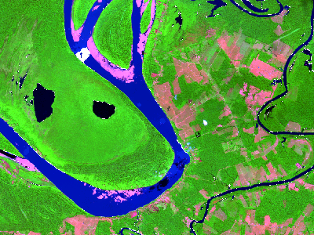
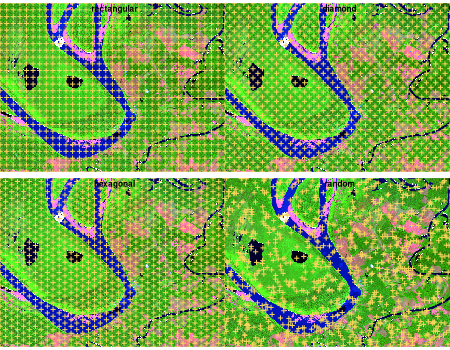
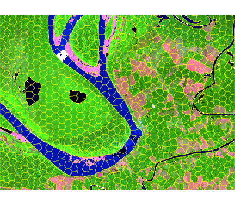
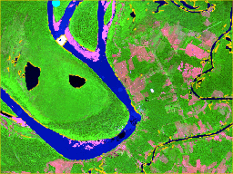

# snic <a id="top"></a>

<!-- badges: start -->

[](https://github.com/rolfsimoes/snic/actions/workflows/R-CMD-check.yaml)
[](https://app.codecov.io/gh/rolfsimoes/snic?branch=dev)
<!-- badges: end -->

Efficient superpixel segmentation for multi-band imagery using the
Simple Non-Iterative Clustering (SNIC) algorithm. The package wraps a
C++ implementation with an ergonomic R interface, integrates with
`terra` for raster workflows, and provides helpers for seed placement,
plotting, and reproducibility.

## Installation

The `snic` package can be installed from CRAN:

``` r
install.packages("snic")
```

Or the development version from GitHub:

``` r
# install.packages("remotes")
remotes::install_github("rolfsimoes/snic")
```

The `terra` package is suggested for raster support and required for
most of the plotting utilities demonstrated below.

## Highlights

- Implements SNIC with a fast C++ core exposed to R
- Works with in-memory `arrays` or `terra::SpatRaster` objects
- Offers multiple seeding strategies via
  `snic_grid(type = c("rectangular", "diamond", "hexagonal", "random"))`
  and interactive placement via `snic_grid_manual()`
- Includes ready-to-plot utilities (`snic_plot()`) for quick inspection
  of inputs, seeds, and resulting segments

## Requirements

- **Raster support.** `terra (>= 1.7)` is suggested and is required for
  every raster example below. In-memory `array` workflows can skip it,
  but you will lose the quick plotting helpers.
- **Animation support.** `magick` is optional and only needed for
  `snic_animation()`. The chunk is cached so missing the package merely
  skips the demo.

## Why SNIC?

SNIC produces compact superpixels in near-linear time and avoids the
iterative updates of SLIC-like algorithms. The `snic` package exposes
those speed benefits through:

- A C++ core that processes moderate Sentinel-2 tiles (thousands x
  thousands of pixels x multiple bands) in a few seconds on a laptop.
- Native `terra` integration, so you keep CRS, extent, and metadata
  intact.
- Reproducible seeding helpers, which makes parameter sweeps easy to
  script and compare.

## Pipeline overview

The SNIC workflow is short and reproducible:

- **Step 1 - Seed placement.** Select or draw a grid of starting seeds
  that guide where the superpixels will grow. Grids can be generated
  automatically with `snic_grid()` (rectangular, diamond, hexagonal, or
  random layouts) or crafted interactively with `snic_grid_manual()`.
- **Step 2 - Segmentation.** Run `snic()` with the chosen seeds to grow
  superpixels and inspect the result with `snic_plot()` or the animated
  helper `snic_animation()`.

## Quick start

The example below demonstrates a typical SNIC workflow with the bundled
Sentinel-2 subset.

``` r
library(snic)
library(terra)

# Sentinel-2 subset packaged with snic
data_dir <- system.file("demo-geotiff", package = "snic", mustWork = TRUE)
bands <- c("B02", "B04", "B08", "B12")
paths <- file.path(
  data_dir,
  sprintf("S2_20LMR_%s_20220630.tif", bands)
)
s2 <- terra::rast(paths)
names(s2) <- bands

# Visualise RGB composite with superpixel boundaries
snic_plot(
  s2,
  r = "B12", g = "B08", b = "B02",
  stretch = "lin"
)
```

<figure>

<figcaption aria-hidden="true">RGB composite of the Sentinel-2 subset
with SNIC superpixel boundaries.</figcaption>
</figure>

## Step 1 - Seed placement

Seed placement controls the number, shape, and location of the resulting
superpixels. The package ships with several grid generators, each
returning a two-column (`r`, `c`) matrix ready for `snic()`:

- `snic_grid(type = "rectangular")` - equally spaced seeds along rows
  and columns.
- `snic_grid(type = "diamond")` - staggered rows produce a diagonal
  pattern that better respects gradients.
- `snic_grid(type = "hexagonal")` - hexagonal tiling for more isotropic
  superpixels.
- `snic_grid(type = "random")` - jittered seeds when structure is
  irregular or prior knowledge is limited.

Use `snic_count_seeds()` to forecast how many superpixels a spacing will
produce before running the algorithm.

``` r
set.seed(42)

grid_types <- c("rectangular", "diamond", "hexagonal", "random")
seed_examples <- lapply(grid_types, function(tp) {
    snic_grid(s2, type = tp, spacing = 30L, padding = 0L)
  }
)

op <- par(mfrow = c(2, 2), mar = c(1.5, 1.5, 2, 1))

for (i in seq_along(seed_examples)) {
  snic_plot(
    s2,
    r = 4, g = 3, b = 1,
    stretch = "lin",
    seeds = seed_examples[[i]],
    seeds_plot_args = list(pch = 3, col = "#F6D55C", lwd = 2)
  )
  title(grid_types[i])
}
```

<figure>

<figcaption aria-hidden="true">Seed placement strategies on the
Sentinel-2 example (spacing = 30).</figcaption>
</figure>

``` r

snic_count_seeds(s2, spacing = 30L)
#> [1] 850

par(op)
```

### Interactive placement

Automatic grids get you started quickly, but experts can refine seeds
interactively. `snic_grid_manual()` opens a plotting device where you
can add, move, or remove seeds on-the-fly and then feed the result
straight into `snic()`:

``` r
manual_seeds <- snic_grid_manual(
  s2,
  base_seeds = seeds_rect,
  r = 4, g = 3, b = 1,
  stretch = "lin"
)

seg_manual <- snic(
  s2,
  seeds = manual_seeds,
  compactness = 0.1
)
```

## Step 2 - SNIC segmentation

Once seeds are defined, pass them to `snic()` together with the imagery
and a `compactness` factor. The result is a labeled raster that can be
visualized alongside the seeds for validation.

``` r

seg_hex <- snic(s2, seeds = seed_examples[[3L]], compactness = 0.2)

snic_plot(
  s2,
  r = "B12", g = "B08", b = "B02",
  stretch = "lin",
  seg = seg_hex,
  seg_plot_args = list(border = "#FFFF00", col = NA, lwd = 0.6)
)
```

<figure>

<figcaption aria-hidden="true">SNIC segmentation output overlaid on the
Sentinel-2 composite.</figcaption>
</figure>

## Animated seeding review

`snic_animation()` replays the seeding process, adding one seed per
frame, re-running `snic()`, and composing the frames into a GIF. Cache
the chunk so the animation is generated only once.

``` r
if (!requireNamespace("magick", quietly = TRUE)) {
  stop("Install the 'magick' package to render the animation.")
}

unlink("man/figures/segmentation-animation.gif")

set.seed(123)
animation_seeds <- snic_grid(s2, type = "random", spacing = 20L, padding = 0L)

gif_path <- snic_animation(
  s2,
  seeds = animation_seeds,
  file_path = "man/figures/segmentation-animation.gif",
  max_frames = 20L,
  delay = 30,
  r = 4, g = 3, b = 1,
  stretch = "lin",
  seeds_plot_args = list(pch = 16, col = "#00FFFF", cex = 1),
  seg_plot_args = list(border = "#FFD700", col = NA, lwd = 0.6),
  snic_args = list(compactness = 0.1),
  device_args = list(height = 192, width = 256, res = 120, bg = "white")
)
```



## Contributing

Bug reports, feature requests, and pull requests are welcome in the
[issue tracker](https://github.com/rolfsimoes/snic/issues). When
proposing changes:

- Run `R CMD check` or `devtools::check()` to keep the package stable.
- Re-knit `README.Rmd` if you touch code chunks so plots stay in sync.
- Mention whether raster dependencies (`terra`, `magick`) were available
  when reproducing a bug, as it affects plotting and animation paths.
